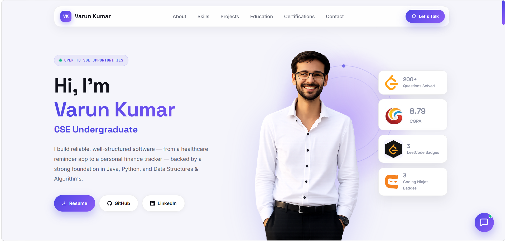

<div align="center">

# ✦ Varun Kumar — Developer Portfolio

**A modern premium personal portfolio featuring an AI-powered assistant, responsive design, smooth animations, and interactive UI — built entirely with vanilla HTML, CSS, and JavaScript.**

Live Preview

👉 **View My Portfolio:**  
[View](https://varunportfolio2327.netlify.app/)



</div>

---

# Overview

This is my personal developer portfolio built completely with **HTML, CSS, and JavaScript**, without using any frontend frameworks or build tools.

The website showcases my technical skills, projects, education, certifications, achievements, and professional profile through a clean and modern interface with smooth animations and responsive layouts.

One of its key highlights is an integrated **AI Portfolio Assistant** that answers questions about my projects, skills, education, and experience in an interactive chat interface.

---

# ✦ Features

## Modern UI & Design

- Premium light theme UI
- Fully responsive layout
- Smooth scroll animations
- Glassmorphism-inspired cards
- Gradient typography
- Sticky navigation bar
- Scroll progress indicator
- Interactive hover effects
- Mobile-friendly navigation
- Professional hero section

---

## Portfolio Sections

### Hero

- Professional introduction
- Resume download
- GitHub & LinkedIn buttons
- Coding statistics
- Premium hero illustration

### About

- Personal introduction
- Career objective
- Developer profile

### Skills

Organized skill categories including

- Programming Languages
- Web Technologies
- Databases
- Development Tools
- Core Computer Science Subjects
- Soft Skills

---

### Projects

Featured project showcase including

- **MediPulse**
  - Smart Personal Health Companion
  - Medicine reminders
  - Health dashboard
  - Family profiles
  - Client-side architecture

- **MoneyMate**
  - Personal Finance Tracker
  - Expense management
  - Budget tracking
  - Financial analytics

Each project includes

- Description
- Technology stack
- Live UI preview
- GitHub repository

---

### Education

Timeline-based education section featuring

- University
- Degree
- School education
- Academic achievements

---

### Certifications

Professional certification cards with

- Issuing organization
- Completion date
- Certificate information

---

### Contact

- Interactive contact form
- Email
- GitHub
- LinkedIn
- Professional contact information

---

# AI Portfolio Assistant

The portfolio includes an intelligent AI assistant that can answer questions about:

- Skills
- Projects
- Education
- Certifications
- Resume
- Experience
- Career goals

### Features

- Floating chat widget
- Suggestion chips
- Typing animation
- Interactive conversation
- Session chat history
- Clean modern interface

---

# Technical Highlights

- Pure HTML5
- CSS3
- Vanilla JavaScript
- Responsive Design
- CSS Variables
- Modern Flexbox & Grid
- Scroll Animations
- Mobile Optimized
- Semantic HTML
- Smooth Navigation

---

# Tech Stack

| Category | Technologies |
|-----------|--------------|
| Languages | Java, Python, JavaScript |
| Frontend | HTML5, CSS3, JavaScript |
| Database | MySQL |
| Tools | Git, GitHub, VS Code |
| Concepts | DSA, OOP, DBMS, Operating Systems, Computer Networks |

---

# Projects Included

| Project | Technologies | Highlights |
|----------|-------------|------------|
| MediPulse | HTML, CSS, JavaScript | Smart Health Companion with medicine reminders and health tracking |
| MoneyMate | HTML, CSS, JavaScript | Personal expense tracker with budgeting and analytics |

---

# Highlights

- Premium responsive portfolio
- AI-powered portfolio assistant
- Resume download
- Interactive project showcase
- Modern animations
- Mobile optimized
- Clean code architecture
- Professional UI/UX

---

# Folder Structure

```
Portfolio/
├── profile.png
├── screenshot.png
├── index.html
├── README.md
└── resume.pdf
```

---

# Connect With Me

| | |
|---|---|
| **Email** | varunkvdmv12@gmail.com |
| **GitHub** | https://github.com/varunGit2327 |
| **LinkedIn** | https://linkedin.com/in/varunkumar257 |
| **LeetCode** | https://leetcode.com/u/varun_2327 |

---

<div align="center">

### ⭐ If you like this portfolio, don't forget to give this repository a star.

**Designed & Developed by Varun Kumar**

Open to Software Development and Internship Opportunities 🚀

</div>